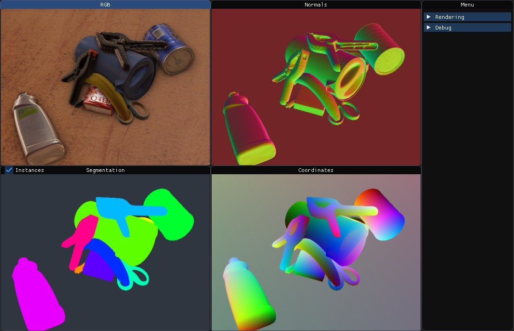

# stillleben

  

What can it do for me?
----------------------

stillleben generates realistic arrangements of rigid bodies and provides
various outputs that can be used to train deep learning models.

For more information, we refer to the project homepage:
https://AIS-Bonn.github.io/stillleben/

Credits
-------

stillleben is developed by Max Schwarz <max.schwarz@ais.uni-bonn.de>, with
differentiation support added by
Arul Selvam Periyasamy <periyasamy@ais.uni-bonn.de>.

License
-------

stillleben is licensed under the MIT license (see LICENSE). It is built
on top of the following third-party modules:

 * [Magnum 3D Engine] (MIT),
 * [PhysX] physics engine (BSD-3),
 * [V-HACD] (included in `contrib/v-hacd`, BSD-3)
 * [imgui] (included in `contrib/imgui`, MIT)
