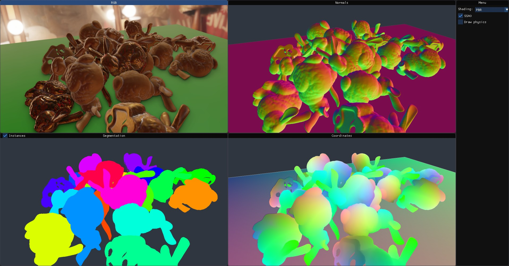

Physically-based Rendering
==========================

This is based on the :ref:`Viewer <std:doc:viewer>` example, but adds an sIBL
light map (see :ref:`stillleben.LightMap`), which enables highly realistic
environment reflections and illumination.

.. include:: ../../examples/pbr.py
    :code: python
    :start-line: 18
