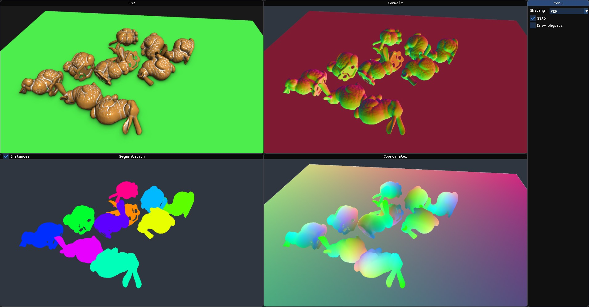

Simple viewer
=============

This example demonstrates loading of a mesh, instantiating it multiple times
in the scene, finding a physically plausible arrangement using
:ref:`stillleben.Scene.simulate_tabletop_scene()` and finally launching the
interactive viewer.

For more realistic lighting, see the :ref:`PBR example <std:doc:pbr>`.

Source code
-----------

.. include:: ../../examples/viewer.py
    :code: python
    :start-line: 5
